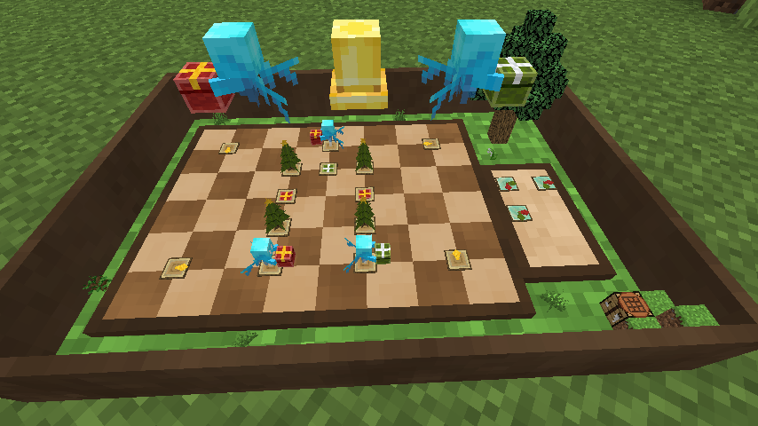

# Present Box Express

[日本語で読む](README.md)

Welcome to the **Present Box Express** data pack!  
`A mini-game data pack inspired by Infinity Nikki’s "Wishing Orb Express".`  
This guide explains how to set up and enjoy the game. Deliver presents with the help of Allays!  

## Introduction Video

---

## Supported Version

- 1.21.4

---

## Installation Instructions

### Adding to Your Favorite World

You can add this data pack to your favorite Minecraft world.  
Place the following folders into the `datapacks` folder of your world:

- PresentBoxExpress
- TriggerManager
- crypto_datapack

Place the following folder into the server's resource pack folder or each player's resource pack folder, and apply it:

- PresentBoxExpressResource

### Using as a New World

A pre-configured world is also available for download:  
<https://u.pcloud.link/publink/show?code=kZxQd55ZDT5LFzd423hl5807LrOWGHQOoTKy>

---

## Getting Started

1. **Start the Mini-Game**
   - Open the chat window and type the following:  
`trigger PresentBoxExpress`
   - This will place the game board at the location you executed the command.
2. **Interact with Objects**
   - Interactable objects will glow when you hover over them.
   - Hovering over an object displays its left-click interaction.
   - If right-clicking is supported, the right-click interaction will also be displayed.

---

## How to Play

1. **Select a Stage**
   - Left-click the large Allay to switch stages.
   - Once you've selected a stage, left-click the large bell to confirm.
2. **Place Signs**
   - Left-click the blue sign to select it.
   - Highlighted locations indicate where you can place the sign. Left-click your desired location to move the blue sign there.
3. **Rotate Signs**
   - Right-click the blue sign to rotate it. Adjust the direction as needed.
4. **Start the Game**
   - Left-click the bell to begin the delivery.
   - The Allays will proceed forward, following fixed signs and placed signs to change directions.
5. **Watch the Delivery**
   - If all Allays successfully deliver presents to the correct destinations, the challenge is cleared.

## Tips for Success

- **Avoid Obstacles:** Ensure the Allays don’t collide with other Allays or obstacles.
- **Deliver Accurately:** Make sure the Allays don’t go to a destination of the wrong color.

Strategically place the signs and guide the Allays for a fun delivery experience!

---

## Stage Creation Feature

- You can create custom stages.
- Once you clear a stage you’ve created, a password will be generated for sharing it with others.
- To place a stage editor board, type the following in the chat:
   `trigger PresentBoxExpress.Editor`
- Controls are generally the same as regular play, but you’ll be in editing mode before playing.

### How to Edit a Stage

1. Left-click to change the type of panel.
2. Right-click to change the direction of a panel.
3. Left-click the bell to test if the stage is clearable.
4. Once cleared, a password for the stage will be generated and shown in the chat.
   - The generated password can be copied to your clipboard or posted on X (formerly Twitter).

---

## Adding Stages

- Write the password in a "Book and Quill," hold it, and execute the following command:
`trigger PresentBoxExpress.Load`
- The stage corresponding to the password will be added and selectable.
- Search #BlessedAllayDelivery on X (formerly Twitter) to find publicly shared passwords.

---

## Q&A

- **How do I mute or adjust the BGM?**
  - Adjust the volume of "Jukebox/Note Blocks" in the sound settings.
- **How do I remove the placed game board?**
  - If not locked, right-click the minimized game board to remove it.
- **How can I lock a stage?**
  - Apply the "locked" tag to the game board to prevent stage changes or deletion.

---

## Production

- **Data Pack**  
  Ai Akaishi: <https://x.com/AiAkaishi>
- **Resource Pack**  
  Ai Akaishi  
  Culoe: <https://x.com/Culoe_mc>
- **World**  
  TUSB: <https://x.com/TUSkyBlock>

## Resources Used

- **BGM:**  
  MusMus: "Snow and Children"  
  <https://musmus.main.jp/music_img1_06.html>
- **Datapacks:**  
  - TriggerManager:  
    <https://github.com/Ai-Akaishi/TriggerManager>
  - crypto_datapack:  
    <https://github.com/Elias-rin/Crypto_DataPack>

---

## Contact

<https://x.com/AiAkaishi>

## License

- The crypto_datapack has been modified, used, and redistributed with the author's permission.  
- All other code is released under the MIT License. Please refer to the LICENSE file for details.
