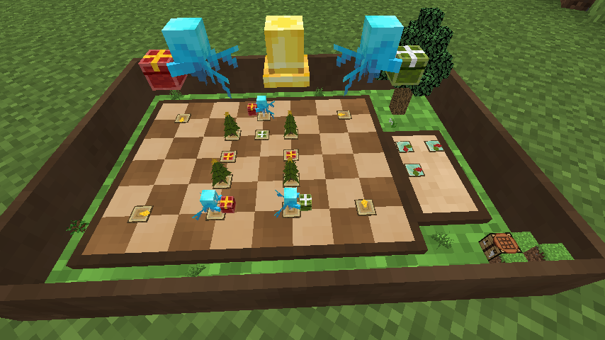

# Present Box Express - 祝福のアレイ便 -

[Read in English](README_en.md)

**Present Box Express** データパックへようこそ！  
`インフィニティニキの速達の願い玉を再現したミニゲームデータパックです。`  
このガイドでは、セットアップ方法や遊び方を詳しく説明します。アレイと一緒にプレゼントを届けましょう！  

## 紹介動画

---

## 動作確認済みバージョン

- 1.21.4

---

## インストール方法

### 好きなワールドに入れる

好きなMinecraftワールドに追加して遊べます。  
以下のフォルダをワールドの`datapacks`フォルダに入れてください。

- PresentBoxExpress
- TriggerManager
- crypto_datapack

以下のフォルダをサーバーリソースパックに入れるか、各人のリソースパックフォルダに入れて適用してください。

- PresentBoxExpressResource

### 新規ワールドとして入れる

適用済みのワールドも用意しています。  
以下よりダウンロードできます。  
<https://u.pcloud.link/publink/show?code=kZxQd55ZDT5LFzd423hl5807LrOWGHQOoTKy>

---

## 始め方

1. **ミニゲームを起動する**
   - チャット欄を開き、以下を入力します：  
`trigger PresentBoxExpress`
   - これで実行した場所にミニゲームのボードが設置されます。
2. **操作する**
   - 操作可能なオブジェクトは、カーソルを合わせると光ります。
   - オブジェクトにカーソルを合わせると、左クリック時の動作が表示されます。
   - 右クリックが対応している場合は、右クリック時の動作も表示されます。

---

## 遊び方

1. **ステージを選ぶ**
   - 大きなアレイを左クリックしてステージを切り替えます。
   - 好みのステージを選んだら、大きなベルを左クリックして決定します。
2. **標識を設置する**
   - 青い標識を左クリックして選択します。
   - 設置可能な場所が表示されるので、好きな場所を左クリックして青い標識を移動させます。
3. **標識を回転する**
   - 青い標識を右クリックすると回転します。必要に応じて方向を調整してください。
4. **ゲームをスタートする**
   - ベルを左クリックして配達を開始します。
   - アレイは前進していき、フィールド上の固定された標識や配置した標識に従って方向転換します。
5. **配達を見届ける**
   - 全てのアレイがプレゼントを正しいゴールに届けることができればチャレンジ成功です。

## クリアのコツ

- **障害物を避ける：** アレイが他のアレイや障害物に衝突しないように注意してください。
- **正しく配達する：** アレイが間違った色の目的地に行かないようにしましょう。

上手に標識を設置して、アレイを導きましょう！楽しい配達を！

---

## ステージ作成機能

- 独自のステージを作成できます。
- ステージを作成してクリアすると、そのステージを他の人と共有するための合言葉が表示されます。
- ステージ作成用のボードを設置するには、チャット欄で以下を入力します：  
   `trigger PresentBoxExpress.Editor`
- 操作方法は基本的に通常プレイと同じですが、プレイ前にステージ編集モードになります。

### ステージ編集方法

1. 左クリックすることでパネルの種類を変更できます。
2. 右クリックすることでパネルの向きを変更できます。
3. ベルを左クリックしてクリア可能か確認しましょう。
4. クリアするとそのステージの合言葉が生成され、チャット欄に通知されます。
   - 生成された合言葉は、クリップボードにコピーしたり、X（旧Twitter）でポストすることができます。

---

## ステージ追加機能

- 合言葉を「本と羽ペン」に記入して、それを手に持った状態で以下を実行します：  
`trigger PresentBoxExpress.Load`
- これで合言葉に対応したステージが追加され、選択できるようになります。
- X(旧twitter)で #祝福のアレイ便 で検索すると、合言葉が公開されているかもしれません。

---

## Ｑ＆Ａ

- BGMを消したい/ボリューム調整したい  
  - BGMは「ジュークボックス/音符ブロック」の音量を調整してください。
- 設置したミニゲームボードを撤去したい  
  - ロックされていなければ、ミニゲームボードが最小化された状態で右クリックすると消せます。
- ステージを固定したい  
  - ミニゲームボードにlockedタグを付けると、ステージ変更や削除を防げるようになっています。

---

## 製作

- データパック
  赤石愛 <https://x.com/AiAkaishi>
- リソースパック
  赤石愛
  Culoe <https://x.com/Culoe_mc>
- ワールド
  TUSB <https://x.com/TUSkyBlock>

## 利用しているもの

- BGM  
  MusMus:『雪と子供』  
  <https://musmus.main.jp/music_img1_06.html>
- Datapack  
  - TriggerManager  
    <https://github.com/Ai-Akaishi/TriggerManager>
  - crypto_datapack  
    <https://github.com/Elias-rin/Crypto_DataPack>

---

## 連絡はこちら

<https://x.com/AiAkaishi>

## ライセンス

- crypto_datapackは作者の許可を得て改変・利用・再配布しています。  
- その他のコードはMITライセンスの下で公開されています。LICENSEファイルを参照してください。
